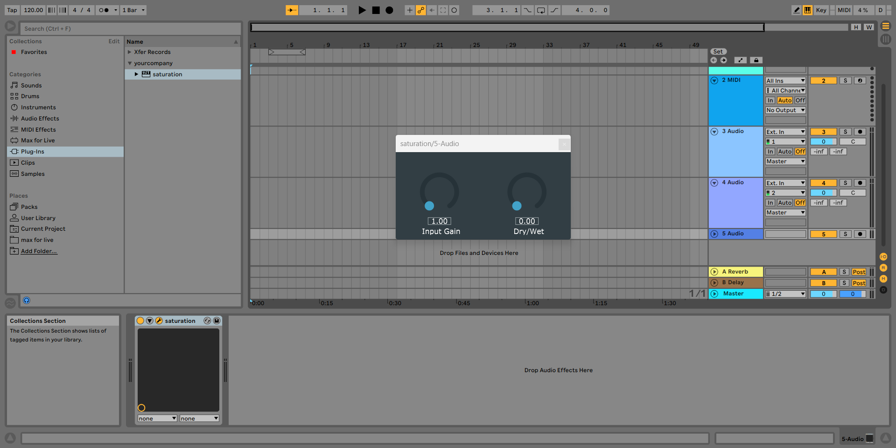
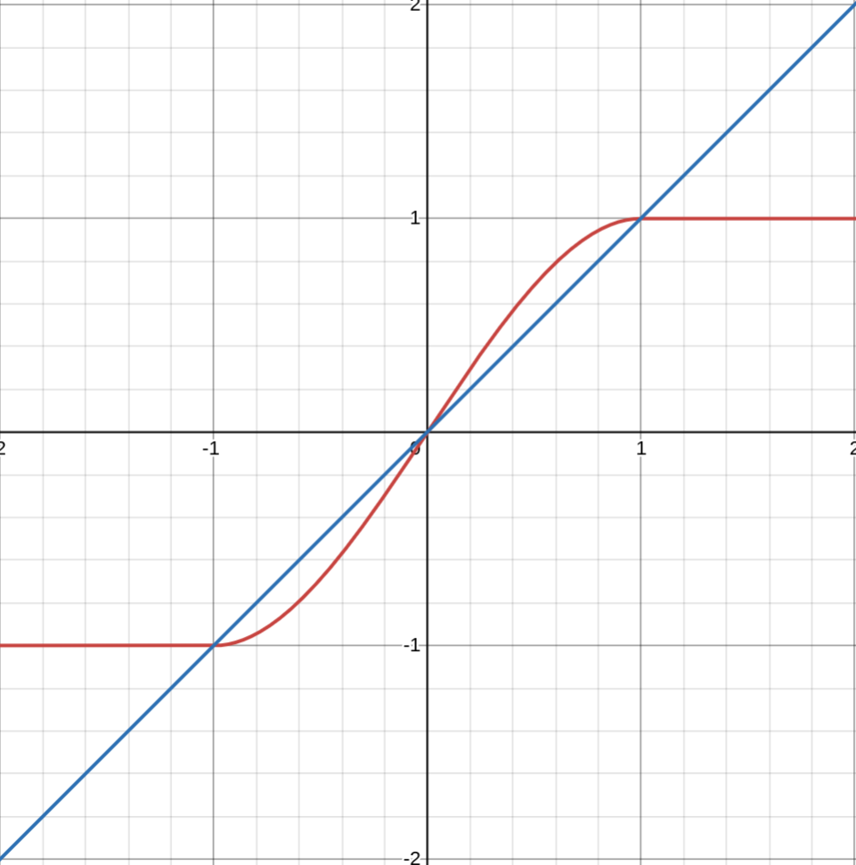

Here is a picture of the plug-in used in Ableton Live:  
  

How the plug-in works:  
The sample $n$ of the output signal out$[n]$ is $f($in$[n])$ with in$[n]$ the sample $n$ of the input signal and $f$ a waveshaping function which is a saturating function $f:  x\mapsto  -1$ if $x\leqslant -1, 1.5x-0.5x^{3}$ if $-1 \lt x \lt 1 ,1$ if $x \geqslant 1$.  

The function is as follows:  
  

The definition of this function is done in DSP_functions.cpp.  

The plug-in has two knobs. The first, "Input gain", multiplies the input signal by a constant before applying the waveshaping function. The second, "Dry/Wet", allows to blend the output signal of the plug-in (wet signal) with the untouched input signal (wet signal).  

How to build the plug-in:  
Install the Juce Projucer  
Set up a default project for an audio plug-in  
Replace the source code from the default project with the source code from this repository  
Build the code to produce a VST3 plug-in  

